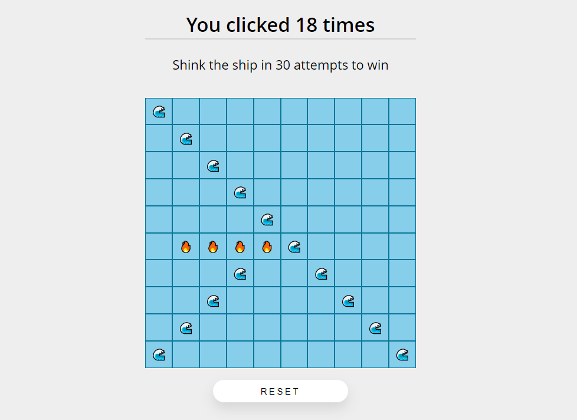

<div align='center'>
	<br>
	<h1>Sea Battle</h1>
</div>

<!-- PROJECT SHIELDS -->
<div align='center'>

   
   
   
   

</div>

<!-- ABOUT THE PROJECT -->
## About The Project



Sea Battle is a simple game created similar to a sea battle. There is a 10x10 square in which the ship is located. If there was a hit on the ship, then it will be shown. If not, then nothing will be shown. There is also a counter of moves, that is, how many moves were spent on sinking the ship. As soon as the ship is sunk, the game ends. 

## Built With

* [TypeScript](https://www.typescriptlang.org/)
* [React](https://reactjs.org/) 
* [HTML](https://developer.mozilla.org/en-US/docs/Web/HTML) 
* [SCSS](https://sass-lang.com/) 

<!-- GETTING STARTED -->
## Getting Started

### Prerequisites

* [Git](https://git-scm.com)
* [Node.js](https://nodejs.org/en/download/)
* [npm](http://npmjs.com)

### Installation

```sh
# Step 1: Clone the repository
$ git clone https://github.com/RadyaBen/Sea-Battle.git

# Step 2: Go into the repository 
$ cd Sea-Battle

# Step 3: Install NPM packages
$ npm install

# Step 4: Run the app 
$ npm start
```